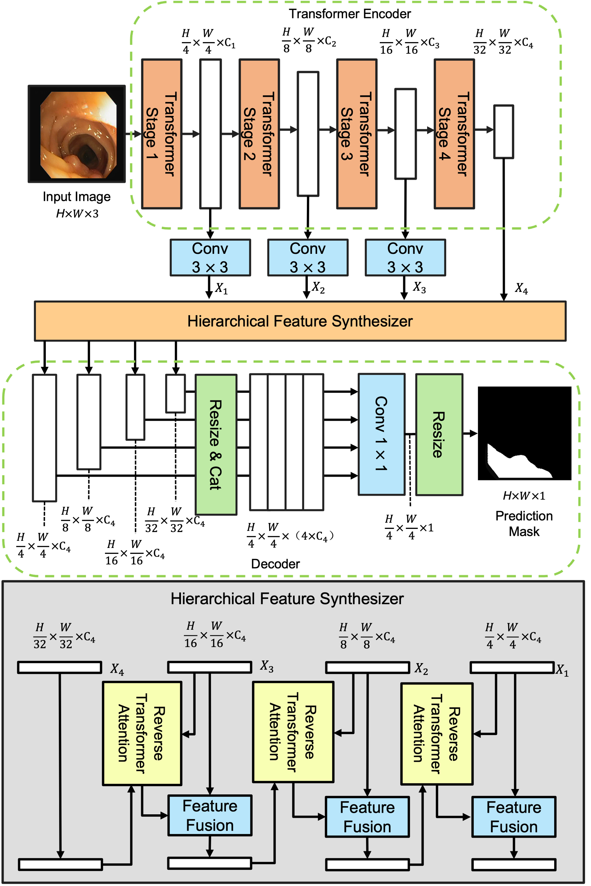
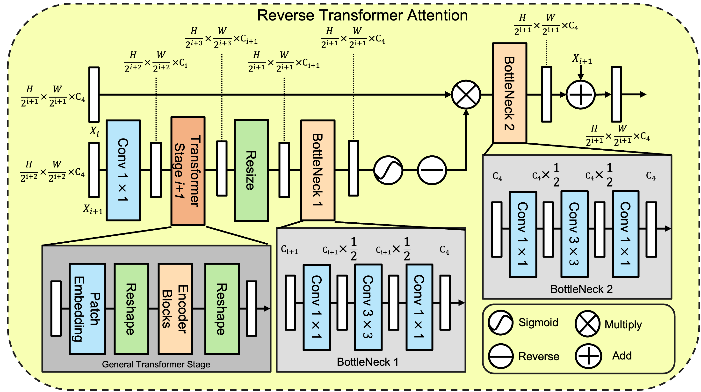

# RTA-Former
**This is the official code repo of "RTA-Former: Reverse Transformer Attention for Polyp Segmentation"**

## Updates
- **April 15, 2024**: Our paper has been accepted by EMBC 2024.
- **April 15, 2024**: The segmentation mask has been uploaded. You can download it freely from: "RTA-Former_b5_outputs.zip".
- **January 5, 2023**: The official code repository is announced; code release pending paper acceptance.

https://arxiv.org/abs/2401.11671#:~:text=The%20strong%20capability%20of%20RTA,clinical%20decisions%20and%20patient%20outcomes.






## Citation
If you use RTA-Former in your research, please cite our paper as follows:

```bibtex
@article{li2024rta,
  title={RTA-Former: Reverse Transformer Attention for Polyp Segmentation},
  author={Li, Zhikai and Yi, Murong and Uneri, Ali and Niu, Sihan and Jones, Craig},
  journal={arXiv preprint arXiv:2401.11671},
  year={2024}
}
```
